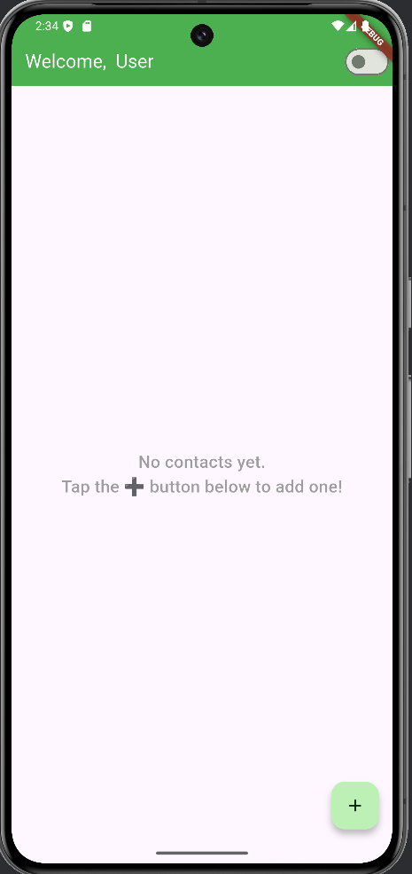
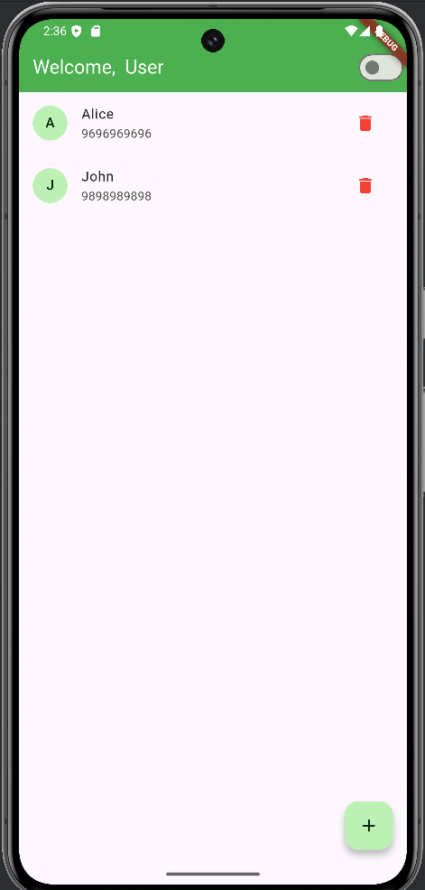
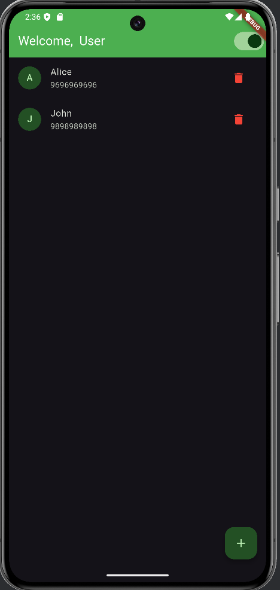
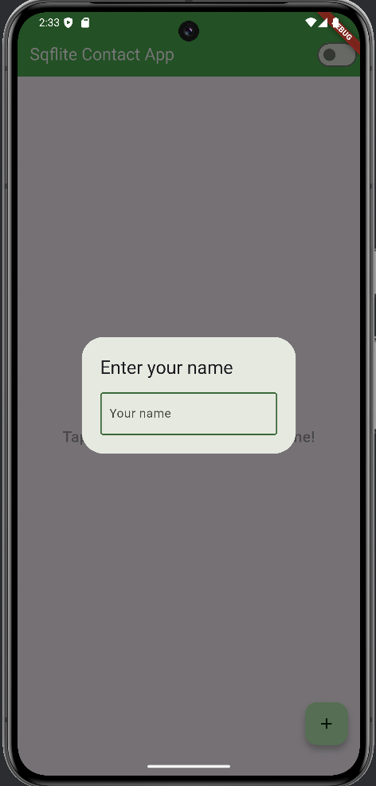
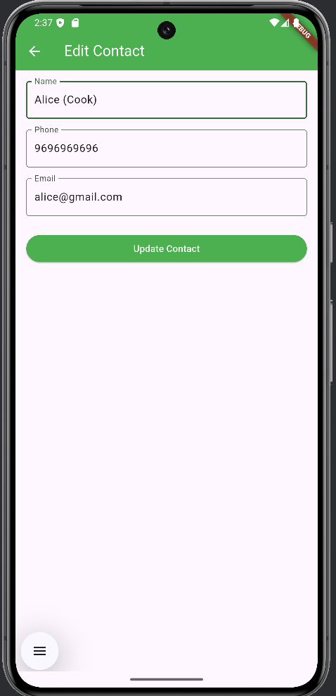
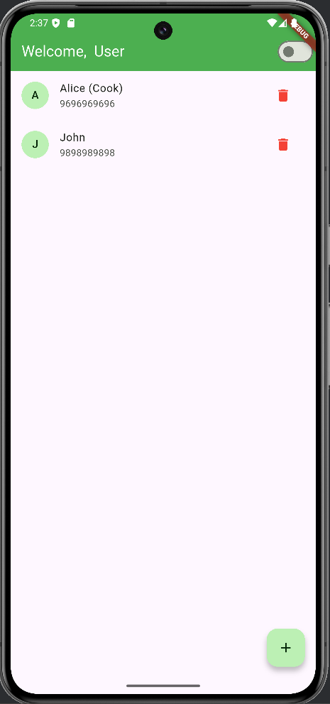

# 📱 Contact App

A simple Flutter-based contact management app that allows users to add, view, and delete contacts with support for light and dark mode themes.

---

## ✨ Features

- 👤 Add new contacts with name, phone, and email
- 📋 View contact list with initials
- 🗑️ Delete contacts
- 🌙 Toggle between Light & Dark Mode
- 📱 Beautiful and responsive UI
- 👋 User personalization with name input
- 🎨 Material Design UI components

---

## 📸 Screenshots

| Add Contact | Light Mode (With Contacts) | Dark Mode |
|:-----------:|:--------------------------:|:---------:|
|  |  |  |

|                       User Setup                        |                   Update State                   |                  Contact Details                  |
|:-------------------------------------------------------:|:------------------------------------------------:|:-------------------------------------------------:|
|  |  |  |

---

## 🚀 Getting Started

### Prerequisites

- Flutter SDK (>=3.0.0)
- Dart SDK
- Android Studio / VS Code
- Android/iOS device or emulator

---

### Installation

#### Clone the repository

```bash
git clone https://github.com/your-username/contact_app_flutter.git
cd contact_app_flutter
