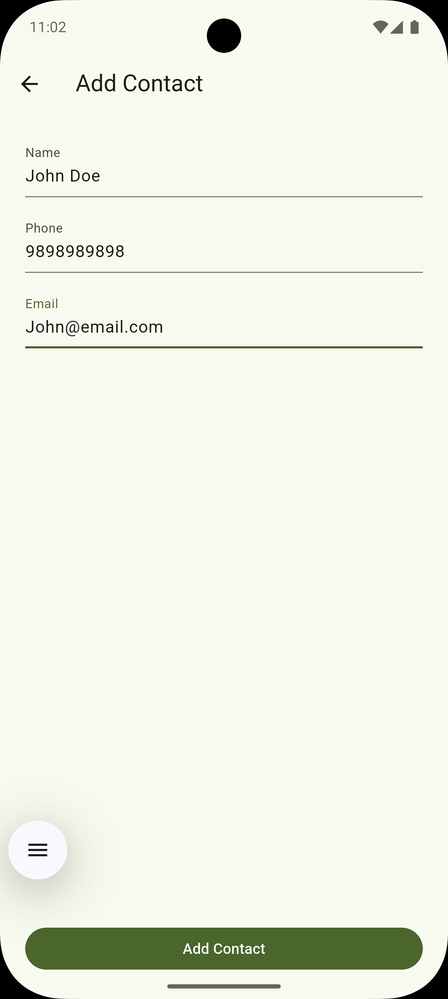

# 📱 Contact App

A comprehensive Flutter-based contact management app with dialer functionality that allows users to add, view, call, and manage contacts with support for light and dark mode themes.

---

## ✨ Features

- 👤 **Contact Management**

  - Add new contacts with name, phone, and email
  - View contact details and information
  - Edit and update existing contacts
  - Delete contacts from the list

- 📞 **Dialer & Calling**

  - Built-in dialer with T9 keypad
  - Direct calling functionality
  - Smart contact suggestions while dialing
  - Call management (mute, hold, end call)

- 🎨 **UI/UX Features**

  - Toggle between Light & Dark Mode
  - Beautiful and responsive Material Design UI
  - User personalization with name input
  - Contact initials display
  - Smooth animations and transitions

- 🔧 **Additional Features**
  - Welcome screen with user name
  - Contact favorites support
  - Search and filter contacts
  - Empty state handling

---

## 📸 Screenshots

### User Experience & Theme

|                    Home (Dark)                     |                     Home (Light)                     |                  Landing Page                   |
| :------------------------------------------------: | :--------------------------------------------------: | :---------------------------------------------: |
|  |  |  |

### Dialer & Calling

|                  Dialer (Dark Mode)                  |                   Dialer (Light Mode)                    |                    Active Call                    |
| :--------------------------------------------------: | :------------------------------------------------------: | :-----------------------------------------------: |
|  |  |  |

### Contact Management

|                    Contact Details (Light)                     |                    Contact Details (Dark)                    |                    Add Contact                     |
| :------------------------------------------------------------: | :----------------------------------------------------------: | :------------------------------------------------: |
|  |  |  |

### Additional Features

|                       Auto Suggest                       |                    Favorites (Dark)                    |                    Favorites (Light)                     |
| :------------------------------------------------------: | :----------------------------------------------------: | :------------------------------------------------------: |
|  |  |  |

---

## 🚀 Getting Started

### Prerequisites

- Flutter SDK (>=3.0.0)
- Dart SDK
- Android Studio / VS Code
- Android/iOS device or emulator

### Required Permissions

Add these permissions to your `android/app/src/main/AndroidManifest.xml`:

```xml
<uses-permission android:name="android.permission.CALL_PHONE" />
<uses-permission android:name="android.permission.READ_PHONE_STATE" />
<uses-permission android:name="android.permission.MODIFY_AUDIO_SETTINGS" />
```

---

### Installation

#### Clone the repository

```bash
git clone https://github.com/your-username/contact_app_flutter.git
cd contact_app_flutter
```

#### Install dependencies

```bash
flutter pub get
```

#### Run the app

```bash
flutter run
```

---

## 📱 App Navigation

The app features three main tabs:

1. **📞 Contact Tab** - View and manage your contacts
2. **🔢 Dial Tab** - Access the dialer for making calls
3. **⭐ Favorites Tab** - Quick access to favorite contacts

---

_Made with ❤️ using Flutter_
